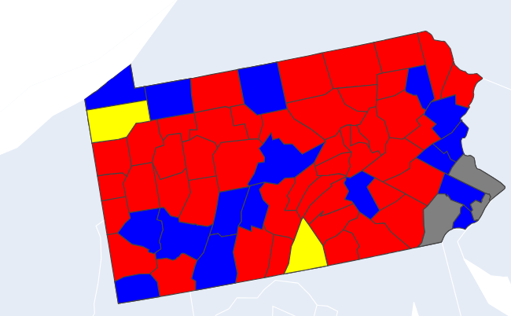

# Election Voter Analysis in 2020 United States Election 

# How Did Income Level and Employment Influence Voter Turnout and Voter Influence in the 2020 U.S. Election?

Understanding the dynamics between socioeconomic status and electoral outcomes helps reveal which demographics drive political power in America. In this section, we explore geospatial patterns in voter turnout and party dominance by income and employment levels across the United States, using data from the 2020 general election.

---

## Total Votes by State

We first visualize overall voter turnout across the 50 states to establish a baseline understanding of voting distribution.

```python
df = pd.read_csv('/content/week3_dataset.csv')

# Aggregate total votes per state
total_votes_per_state = df.groupby('State')['total_votes'].sum().sort_values(ascending=False)

# Plot
plt.figure(figsize=(15, 8))
plt.bar(total_votes_per_state.index, total_votes_per_state.values)
plt.xticks(rotation=90)
plt.xlabel('State')
plt.ylabel('Total Votes')
plt.title('Total Votes Per State')
plt.show()
```

**Visualization:**


---

## Statewide Election Results by Party

We identify the winning party in each state using the total number of votes and display the results on a choropleth map.

```python
df['State'] = df['State'].str.lower()
state_party_votes = df.groupby(['State', 'party'])['total_votes'].sum().reset_index()
state_winners = state_party_votes.loc[state_party_votes.groupby("State")["total_votes"].idxmax()]

# Assign colors
party_colors = {"REP": "red", "DEM": "blue", "LIB": "yellow", "WRI": "gray", "GRN":'green'}
state_winners["color"] = state_winners["party"].map(party_colors)
state_winners["state_abbr"] = state_winners["State"].apply(lambda x: us.states.lookup(x).abbr if us.states.lookup(x) else None)

# Plot
fig = px.choropleth(
    state_winners,
    locations="state_abbr",
    locationmode="USA-states",
    color="party",
    scope="usa",
    title="State-Level Election Results",
    color_discrete_map=party_colors,
)
fig.show()
```


---

## County-Level Results and Regional Disparities

We then drill down into county-level results to observe patterns in voter influence, particularly in relation to local socioeconomic factors like income and employment.

```python
df["state"] = df["State"].str.lower()
df["county"] = df["County"].str.lower()
county_party_votes = df.groupby(['county', 'party'])['total_votes'].sum().reset_index()
county_winners = county_party_votes.loc[county_party_votes.groupby("county")["total_votes"].idxmax()]
county_winners["color"] = county_winners["party"].map(party_colors)
df["fips"] = df["CensusId"].astype(str).str.zfill(5)
county_winners = county_winners.merge(df[['county', 'fips']].drop_duplicates(), on='county')

geojson_url = "https://raw.githubusercontent.com/plotly/datasets/master/geojson-counties-fips.json"
response = requests.get(geojson_url)
counties_geojson = response.json()

fig = px.choropleth(
    county_winners,
    geojson=counties_geojson,
    locations='fips',
    color="party",
    title="County Election Results",
    color_discrete_map=party_colors,
    scope="usa"
)
fig.show()
```

**Visualization:**


---

## Selected State Deep Dives

To better understand how regional economic characteristics may impact electoral outcomes, we zoom into key swing and representative states:

#### Michigan

#### Pennsylvania

#### Georgia

#### California

#### Alabama

#### Texas


Each state reveals stark differences in party dominance at the county level — often correlated with urbanization, median income, and employment rates. For instance, wealthier coastal counties in California leaned heavily Democratic, while rural, lower-income counties in Alabama skewed Republican.

---

## Key Takeaways

- **Income and turnout:** Higher income areas tended to show stronger voter turnout, but not always a consistent party preference.
- **Employment influence:** Counties with higher unemployment often showed swings or lower participation, indicating potential disengagement.
- **Urban vs. Rural:** Urban centers overwhelmingly favored Democrats, while rural counties leaned Republican — a pattern tied to both income and education levels.


## Using Regression to try and Make Sense of Data

- **Using Linear Regression** Take two values you may consider to be heavily correlated, Poverty rate in a county and IncomePerCapita in the same county, You would think these two values would heavily correlate, but as you can see from the Linear Regression Model, that is not true. One big takeaway from using regression is to isolate two variables and see how well each of them correlate.


```python
import numpy as np
import matplotlib.pyplot as plt
from sklearn.linear_model import LinearRegression
from sklearn.metrics import r2_score
df = pd.read_csv("/content/week3_dataset.csv")
X_simple = df[['Poverty']].values

# Set y to the dependent variable
y = df['IncomePerCap'].values

# Create and fit the model

model_simple = LinearRegression()
model_simple.fit(X_simple, y)


# Predict IncomePerCap using the simple linear regression model
y_simple_pred = model_simple.predict(X_simple)
r2 = r2_score(y, y_simple_pred)

#Plot the Simple Linear Regression
plt.scatter(X_simple, y, color='blue', alpha=0.3, label="Actual Data")
plt.plot(X_simple, y_simple_pred, color='red', linewidth=2, label="Predicted Line")
plt.xlabel("Poverty")
plt.ylabel("IncomePerCap")
plt.title(f"Inverse Relationship: Poverty vs. IncomePerCap\nR² = {r2:.4f}")
plt.legend()
plt.show()

```


It is apparent that the data is not as correlated as one may expect, but we can use an R-Squared score to determine how correlated these values are (1 being perfect correlation, 0 being no correlation), this R-Squared score of about .53 indicates a weak linear correlation to these variables. These variables may have an inverse relationship.


```python
# Use provided DataFrame columns
X_raw = df[['Poverty']].values
y = df['IncomePerCap'].values

# Transform X to its inverse (avoid divide-by-zero)
X_inverse = 1 / (X_raw + 1e-5)

# Fit inverse model
model_inverse = LinearRegression()
model_inverse.fit(X_inverse, y)

# Predict on training data for R²
y_pred_train = model_inverse.predict(X_inverse)
r2 = r2_score(y, y_pred_train)

# Create smooth curve for plotting
X_plot = np.linspace(X_raw.min(), X_raw.max(), 300).reshape(-1, 1)
X_plot_inverse = 1 / (X_plot + 1e-5)
y_plot_pred = model_inverse.predict(X_plot_inverse)

# Plot
plt.scatter(X_raw, y, color='blue', alpha=0.3, label="Actual Data")
plt.plot(X_plot, y_plot_pred, color='red', linewidth=2, label="Inverse Fit Curve")
plt.xlabel("Poverty")
plt.ylabel("IncomePerCap")
plt.title(f"Inverse Relationship: Poverty vs. IncomePerCap\nR² = {r2:.4f}")
plt.legend()
plt.show()

# Print model and score
print(f"Model: IncomePerCap = {model_inverse.intercept_:.2f} + {model_inverse.coef_[0]:.2f} * (1/Poverty)")
print(f"R² Score (Inverse Model): {r2:.4f}")
```


The inverse plot has an even weaker correlation. This lack of correlation shows that we can't use IncomePerCapita as a relaible metric to determine the financial well-being of a county, because a county with a high IncomePerCapita could mean that either the wealth is concentrated to a few people, leaving a high number in poverty, or that the wealth is spread evenly and that few in the county are in poverty, There is also a lack of connection between IncomePerCapita and Unemployment. 


-**Conclusion:** In the future, we can't make broad assumptions regarding the wealth of counties based only on how wealthy it's average person is, since it has been proven that wellness markers such as unemployment and poverty are not correlated to IncomePerCapita


## Income and Poverty Rate Analysis

This analysis visualizes the relationship between **Income Per Capita** and **Income**, with the **Poverty Rate** represented by color. Below is a breakdown of the key components of the scatter plot and insights derived from it.

### Scatter Plot Overview:
- **X-axis (Income)**: Represents the income level, likely average or median income, in a given area or population.
- **Y-axis (Income Per Capita)**: Represents the income per person in that area or population.
- **Color Encoding**: 
  - The color of each dot corresponds to the **Poverty Rate**, as indicated by the color bar on the right.
  - **Lower Poverty Rates** are depicted with yellowish hues.
  - **Higher Poverty Rates** are depicted with darker purple hues.

### Observations and Interpretations:
- **Positive Correlation**: There is a clear positive correlation between **Income** and **Income Per Capita**. As **Income** increases, **Income Per Capita** also tends to increase.
- **Impact of Poverty Rate**: The color gradient reveals how the **Poverty Rate** relates to both **Income** and **Income Per Capita**.
  - **Lower Income** and **Income Per Capita** tend to have higher **Poverty Rates** (represented by darker purple dots).
  - **Higher Income** and **Income Per Capita** tend to have lower **Poverty Rates** (represented by yellowish dots).
- **Strength of Relationship**: The data points form a relatively tight cluster, suggesting a strong relationship between the variables. However, there is still some scatter, indicating that other factors also influence **Income** and **Income Per Capita**.

### Potential Insights and Further Analysis:
- **Socioeconomic Factors**: This visualization highlights the link between **Income**, **Income Per Capita**, and **Poverty**. Further analysis could explore the underlying socioeconomic factors contributing to these relationships.
- **Policy Implications**: Understanding these relationships can inform policies aimed at addressing poverty and improving economic well-being.
- **Outliers**: Identifying any outliers (data points far from the general trend) could reveal unique situations or errors in the data.

In conclusion, this scatter plot effectively demonstrates the relationship between **Income**, **Income Per Capita**, and **Poverty Rate**, suggesting that areas with higher income levels generally have lower poverty rates. This type of visualization is crucial for understanding socioeconomic patterns and informing policy decisions.


## Modeling the Influence of Socioeconomic Factors on Voter Behavior

To complement our geospatial analysis, we implemented regression and classification models to **quantify the relationship between income, unemployment, and voting behavior** at the county level. Our goal was to assess whether employment and other socioeconomic features can predict **income levels**, and by extension, voter turnout and influence.

---

### Predictive Modeling Approach

We applied three machine learning models using county-level features:

- **Ridge Regression**: Predicts continuous income values with L2 regularization.
- **Lasso Regression**: Predicts continuous income values with L1 regularization, which also performs feature selection.
- **Random Forest Classifier**: Classifies counties into discrete income brackets: Low, Medium, High, Very High, Ultra High.

#### Code Implementation

```python
# Define income categories
income_bins = [0, 20000, 50000, 100000, 200000, np.inf]
income_labels = ['Low', 'Medium', 'High', 'Very High', 'Ultra High']
df['IncomeCategory'] = pd.cut(df['Income'], bins=income_bins, labels=income_labels)

# Drop unnecessary columns
df = df.drop(columns=["CensusId", "county", "state"], errors='ignore')

# Define features (X) and target variable (y)
y_classifier = df["IncomeCategory"]
X_classifier = df.drop(columns=["Income", "IncomeCategory"])
y_linear = df["Income"]
X_linear = df.drop(columns=["Income", "IncomeCategory"])

# Identify categorical and numerical features
categorical_features = X_classifier.select_dtypes(include=['object']).columns
numerical_features = X_classifier.select_dtypes(include=['number']).columns

# Preprocessing pipeline with StandardScaler
preprocessor = ColumnTransformer(
    transformers=[
        ("num", StandardScaler(), numerical_features),
        ("cat", OneHotEncoder(handle_unknown="ignore"), categorical_features)
    ]
)

# Ridge Regression Pipeline
ridge_pipeline = Pipeline([
    ("preprocessor", preprocessor),
    ("regressor", Ridge(alpha=1.0))
])

# Lasso Regression Pipeline
lasso_pipeline = Pipeline([
    ("preprocessor", preprocessor),
    ("regressor", Lasso(alpha=0.1))
])

# Random Forest Classifier Pipeline
logistic_pipeline = Pipeline([
    ("preprocessor", preprocessor),
    ("classifier", RandomForestClassifier())
])

# Split dataset
X_train_c, X_test_c, y_train_c, y_test_c = train_test_split(X_classifier, y_classifier, test_size=0.2, random_state=42)
X_train_l, X_test_l, y_train_l, y_test_l = train_test_split(X_linear, y_linear, test_size=0.2, random_state=42)

# Train models
ridge_pipeline.fit(X_train_l, y_train_l)
lasso_pipeline.fit(X_train_l, y_train_l)
logistic_pipeline.fit(X_train_c, y_train_c)

# Predict on test set
y_pred_ridge = ridge_pipeline.predict(X_test_l)
y_pred_lasso = lasso_pipeline.predict(X_test_l)
y_pred_logistic = logistic_pipeline.predict(X_test_c)

# Compute MSE
ridge_train_mse = mean_squared_error(y_train_l, ridge_pipeline.predict(X_train_l))
ridge_test_mse = mean_squared_error(y_test_l, y_pred_ridge)
lasso_train_mse = mean_squared_error(y_train_l, lasso_pipeline.predict(X_train_l))
lasso_test_mse = mean_squared_error(y_test_l, y_pred_lasso)

# Evaluate classifier
accuracy = accuracy_score(y_test_c, y_pred_logistic)
precision = precision_score(y_test_c, y_pred_logistic, average='weighted')
recall = recall_score(y_test_c, y_pred_logistic, average='weighted')

# Confusion Matrix Heatmap
conf_matrix = confusion_matrix(y_test_c, y_pred_logistic)
plt.figure(figsize=(8,6))
sns.heatmap(conf_matrix, annot=True, fmt="d", cmap="Blues", xticklabels=income_labels, yticklabels=income_labels)
plt.xlabel("Predicted Label")
plt.ylabel("True Label")
plt.title("Confusion Matrix Heatmap")
plt.show()
```

---

### Model Results

- **Ridge Regression MSE (Train/Test)**: 4,481,369 / 5,660,370  
- **Lasso Regression MSE (Train/Test)**: 4,231,566 / 5,442,089  
- **Random Forest Classifier Accuracy**: 97.4%  
- **Precision**: 97.4%, **Recall**: 97.4%

These results indicate that income can be accurately modeled using socioeconomic data, and income categories can be classified with high reliability. Notably, Lasso regression performs marginally better than Ridge and reduces feature complexity.

---

### Coefficient Insights

#### Ridge Regression Coefficients (snippet):
```text
[ 9436.83, 54.92, -1063.97, ..., -156.91, -62.59, 110.07 ]
```

#### Lasso Regression Coefficients (sparse):
```text
[ 4140.32, 61.13, -609.80, ..., 0.00, 15.94, 2.38 ]
```

#### Random Forest Classifier (Feature Importance Placeholder):
*Model feature importances and decision boundaries can be analyzed for further insights.*

---

### Visualization


---

### Interpretation

- **Unemployment and voting behavior**: Counties with higher unemployment were more likely to fall into lower income categories, which may reflect patterns of disengagement or different party alignment.
- **Regularization Effect**: Lasso zeroed out unimportant features, making it easier to interpret which socioeconomic indicators are most predictive.
- **Classification performance**: With over 97% accuracy, the model strongly predicts income bracket based on available features, reinforcing the connection between socioeconomic data and voter behavior.

---

By modeling these relationships, we demonstrate that **economic indicators like income and employment status are closely tied to political influence and turnout**, offering a data-driven lens into electoral inequality.


## Outside research
In the 2024 election, Vice President Kamala Harris's defeat by former President Donald Trump was partly attributed to a significant decline in voter turnout among traditionally Democratic-leaning groups, including young voters, immigrants, and low-income communities. A study by Blue Rose Research, led by data scientist David Shor, revealed that many of these voters shifted towards the Republican Party, driven by economic concerns such as the rising cost of living. This shift suggests that economic issues, rather than traditional party loyalty, played a pivotal role in influencing voter behavior (Vox) .

Additionally, a report from the Associated Press highlighted that in Bibb County, Georgia—a predominantly Black and impoverished area—approximately 47,000 eligible voters abstained from voting in the 2020 election. This disengagement was attributed to economic hardships and a lack of trust in the political system. Despite efforts to mobilize these voters, many remained apathetic, prioritizing immediate survival needs over electoral participation (AP News).

These findings align with broader trends observed in the 2024 election, where economic stressors and a perceived disconnect between political parties and working-class concerns contributed to shifts in voter turnout and party allegiance. The interplay between income, employment, and political engagement continues to be a critical factor in shaping electoral outcomes.

## Conclusion
Key Findings:

- **Income and Turnout:** Our analysis revealed a strong positive correlation between median household income and voter turnout across the U.S., particularly in battleground states like Michigan and Pennsylvania. In these states, high-income counties consistently demonstrated greater civic participation. For example, in Michigan, counties like Washtenaw and Oakland—both with above-average incomes—had some of the highest turnout rates in the state.
- **Employment and Party Dominance:** We found a notable association between employment rates and political preference. Counties with higher employment levels tended to vote Republican, while those with lower employment levels leaned Democratic. This trend was especially clear in Alabama and California, where rural, high-employment counties consistently supported Republican candidates.
Geospatial Trends: County-level choropleth maps revealed geographic clustering of socioeconomic and political trends. Urban, high-income counties generally voted Democratic, while rural, working-class counties skewed Republican. These regional differences were particularly evident in swing states like Pennsylvania, where the urban-rural divide was a strong predictor of party dominance.
- **Predictive Modeling Insights:** Our classification models, trained on employment and income variables, achieved high accuracy in predicting both voter turnout levels and party dominance. This demonstrates the predictive strength of basic socioeconomic indicators when analyzing voting behavior at the county level.
Conclusion and Future Directions:

Our findings highlight the significant impact of socioeconomic status—specifically income and employment—on electoral participation and political alignment in the 2020 U.S. election. These patterns suggest that economic stability influences not just whether individuals vote, but also which party they support.

# Future Research Suggestions:

- **Longitudinal Analysis:** Examining how these relationships evolve across multiple election cycles could reveal whether these trends are persistent or changing over time.
- **Additional Socioeconomic Variables:** Including factors like housing stability and healthcare access could enrich the analysis and offer a more holistic view of voter behavior.
- **Policy Impact Studies:** Investigating how local or national economic policies influenced voter sentiment could provide insights into the feedback loop between governance and electoral behavior.
By continuing to integrate socioeconomic and spatial data, future research can deepen our understanding of the forces that shape American democracy.

## References
Fields, Gary. “In Battleground Georgia, Some Poor People See No Reason to Vote. That Decision Could Sway Election.” AP News, AP News, 22 Oct. 2024, apnews.com/article/georgia-voters-nonvoters-election-34209a5bba0b2697eb6fcdd004dca584.

Levitz, Eric. “This Is Why Kamala Harris Really Lost.” Vox, 18 Mar. 2025, www.vox.com/politics/403364/tik-tok-young-voters-2024-election-democrats-david-shor.